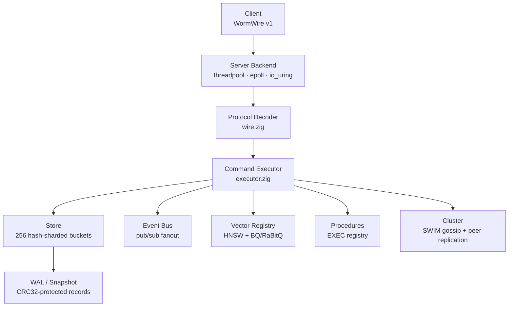
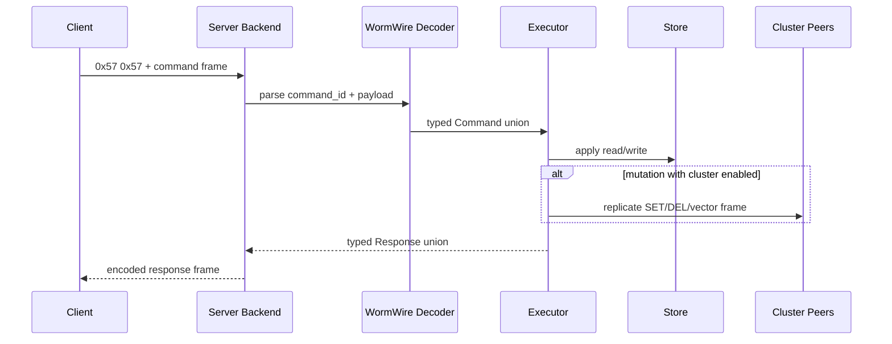

# System Design

WormDB is organized as a layered runtime. Each layer has a single responsibility, and the boundaries between them are explicit — the transport never touches the store, the executor never manages connections, and the protocol decoder doesn't know about persistence.

## Runtime Layers

| Layer         | Source                             | Responsibility                                                |
| ------------- | ---------------------------------- | ------------------------------------------------------------- |
| **Transport** | `src/server/*.zig`                 | Accept TCP connections, read/write WormWire frames            |
| **Protocol**  | `src/protocol/wire.zig`            | Validate frame headers, decode payloads into command unions   |
| **Executor**  | `src/server/executor.zig`          | Dispatch commands to store, event bus, cluster, or procedures |
| **Storage**   | `src/storage/store.zig`, `wal.zig` | Sharded in-memory HashMap, WAL append, snapshot load/save     |
| **Events**    | `src/event/bus.zig`                | Channel subscriptions, publish fanout to connected clients    |
| **Vector**    | `src/vector/`, `src/procedures/vector_ops.zig` | HNSW/BQ/RaBitQ serving index over durable `vec:*` entries |
| **Procedures** | `src/procedures/registry.zig`     | Compiled `EXEC` handlers for atomic workflows and app surfaces |
| **Cluster**   | `src/cluster/node.zig`             | SWIM membership, peer liveness, write replication             |

## Command Execution Flow

Every command follows the same path regardless of which backend is handling the connection:

The executor (`executor.zig`) is a pure function — it takes an `ExecContext` (store, event bus, cluster reference, allocator) and a `Command`, and returns a `Response`. It has no knowledge of TCP connections, framing, or backend-specific IO patterns.

## Data Model

Each entry in the store consists of:

- **key** — arbitrary bytes (up to the 16 MiB frame limit)
- **value** — arbitrary bytes
- **timestamp** — set on write
- **is_worm** — once set to `true`, the key rejects all future SET and DEL operations
- **is_deleted** — soft-delete marker (hard deletion happens at the shard level)

The store is hash-sharded across **256 buckets**. Each shard has its own mutex, so operations on unrelated keys never contend. Stored procedures can lock specific shards for atomic multi-key operations — see [Stored Procedures](/architecture/procedures).

## Durability

WormDB offers three persistence modes via `--persistence`:

| Mode       | Per-Write IO                 | Crash Recovery        |
| ---------- | ---------------------------- | --------------------- |
| `full`     | WAL append (CRC32 protected) | Snapshot + WAL replay |
| `snapshot` | None                         | Last snapshot only    |
| `none`     | None                         | Data lost on exit     |

Snapshots can also persist the vector serving index. Snapshot v2 appends an `WDBHNSW2` trailer with HNSW graph state, tombstones, timestamps, and RaBitQ parameters. See [Persistence Modes](/operations/persistence) for operational guidance on choosing between modes and [Vector Search](/architecture/vector-search) for rebuild behavior.

## Cluster Model

Clustering is optional and enabled with `--cluster <name>`:

- **Discovery**: SWIM gossip protocol over UDP
- **Replication**: mutating commands (`SET`, `DEL`, native vector frames, and durable procedure writes) replicate to peers over persistent WormWire TCP connections after local commit
- **No external coordinator** — no ZooKeeper, no etcd, no Raft leader election

See [Clustering](/operations/clustering) for deployment patterns.

## Related Pages

- [WORM Semantics](/architecture/worm-semantics) — how immutability works and when to use it
- [Server Backends](/architecture/server-backends) — threadpool vs. epoll vs. io_uring tradeoffs
- [Stored Procedures](/architecture/procedures) — the embedded procedure execution model
- [Vector Search](/architecture/vector-search) — HNSW, RaBitQ, native vector frames, and rebuild paths
- [Agent Memory](/architecture/agent-memory) — the `mem_*` procedure surface for AI memory
- [Pub/Sub](/architecture/pubsub) — real-time event distribution
