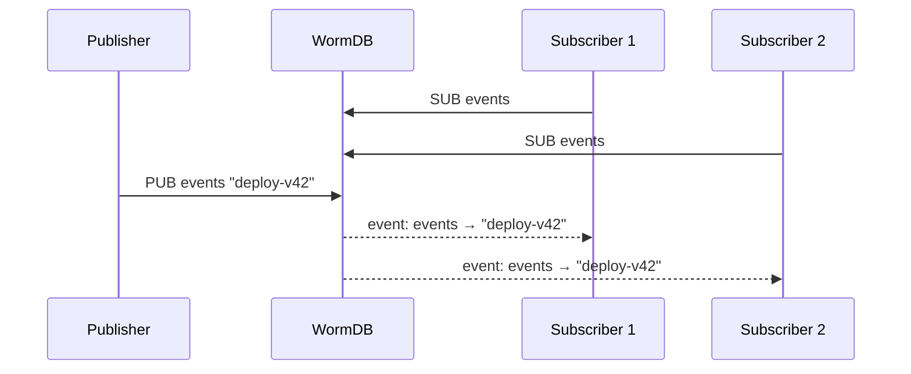

# Pub/Sub

WormDB includes a lightweight publish/subscribe system for real-time event distribution between connected clients. It's best suited for signaling — notifying subscribers that something happened, broadcasting configuration updates, or coordinating between services.

## How It Works

The event bus (`src/event/bus.zig`) maintains a set of named **channels**. Clients can subscribe to channels and receive messages published by other clients. Delivery is fire-and-forget — if a subscriber is temporarily disconnected, it misses the message.



## Commands

### SUB — Subscribe

```bash
bun run apps/bun/src/bin/client.ts SUB <channel>
```

The client stays connected and prints each incoming message. The connection remains open until the client disconnects or calls `UNSUB`.

### UNSUB — Unsubscribe

```bash
bun run apps/bun/src/bin/client.ts UNSUB <channel>
```

Stops receiving messages from the channel. The connection stays open for other operations.

### PUB — Publish

```bash
bun run apps/bun/src/bin/client.ts PUB <channel> <message>
# → OK
```

Delivers the message to all clients currently subscribed to the channel. Returns `OK` regardless of how many (or zero) subscribers received it.

## Event Wire Format

When a message arrives, it's delivered as a WormWire response frame with response code `0x04` (event):

```text
[1B response_code=0x04][4B payload_len BE][payload]

payload = [4B channel_len][channel][4B message_len][message]
```

Client libraries should handle the `0x04` response code to dispatch incoming events separately from command responses.

## Use Cases

**Deployment notifications** — publish to a `deploys` channel when a new version is ready, and have all connected services pick up the signal:

```bash
bun run apps/bun/src/bin/client.ts PUB deploys "v2.4.1"
```

**Cache invalidation** — notify services to re-fetch data when a key is updated:

```bash
bun run apps/bun/src/bin/client.ts PUB cache:invalidate "user:42"
```

**Real-time dashboards** — stream metrics or status changes to connected UI clients.

::: tip
Pub/sub channels are independent from the key-value store. Publishing to a channel called `mykey` has no relationship to a stored key called `mykey`. They are separate namespaces.
:::

::: warning
There is no message persistence or replay. If no subscribers are connected when a message is published, it is silently dropped. For durable event logs, write to WORM keys instead.
:::
