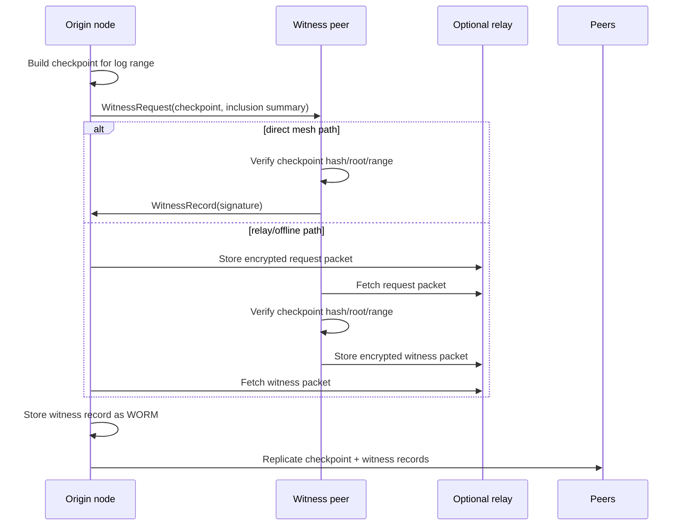

# Replication Proofs

WormDB replication is eventually consistent: writes commit locally first, then
replicate to peers. For ordinary mutable data this is enough. For WORM logs,
replication should also answer harder questions:

- Did this peer see the same immutable history I saw?
- Did a trusted peer countersign this checkpoint root?
- Which ranges are missing after an offline period or relay handoff?
- Can a verifier prove consistency without asking for the whole database?

This page defines the base-level design for meshguard-backed checkpoint
witnessing and Merkle/root anti-entropy. It is a contract for the cluster layer
and proof APIs; it does not move app-specific policy into the database.

## Scope

WormDB owns:

- Canonical hash and signature verification over checkpoint and witness bytes.
- Generic WORM storage for checkpoints, witness signatures, and anti-entropy
  receipts.
- Meshguard identity binding when cluster peers are available.
- Compact root exchange, divergence detection, and range repair decisions.
- Status fields that expose proof health without interpreting application data.

Applications own:

- Choosing which peers are trusted witnesses or supervisors.
- Human approval flows, pairing screens, and relay selection UX.
- GPS capture, device time capture, sensor metadata, and user-facing labels.
- Domain policy such as "two supervisors required" or "GPS accuracy must be
  under 20 meters".

WormDB should preserve app-provided device/GPS time claims as signed payload
fields and verify that the claims are covered by the relevant signatures. It
should not collect location itself or decide whether a location claim is good.

## Data Model

The checkpoint and witness records are ordinary WORM values under reserved
prefixes. The exact binary canonicalization belongs to the checkpoint/proof
bundle work, but the logical fields should remain stable.

### Checkpoint

A checkpoint names one append-only log range and its accumulator state.

```json
{
  "type": "wormdb.checkpoint.v1",
  "cluster_id": "myapp",
  "log_id": "fieldbook:north-yard",
  "from_seq": 1,
  "to_seq": 42,
  "entry_count": 42,
  "root_alg": "mmr-sha256",
  "root": "base64url...",
  "checkpoint_hash": "base64url...",
  "prev_checkpoint_hash": "base64url...",
  "issuer": {
    "mesh_pubkey": "base64url...",
    "device_id": "optional-app-device-id"
  },
  "claims": {
    "device_time_ms": 1780957325000,
    "monotonic_ms": 1044551,
    "gps": {
      "lat": -23.55052,
      "lon": -46.63331,
      "accuracy_m": 11.4,
      "fix_time_ms": 1780957319000,
      "provider": "app"
    }
  },
  "signature": "base64url..."
}
```

The signed preimage must cover at least `cluster_id`, `log_id`, `from_seq`,
`to_seq`, `root_alg`, `root`, `prev_checkpoint_hash`, issuer identity, and any
application-provided claims. `checkpoint_hash` is the hash of the canonical
checkpoint without the outer storage key.

Suggested storage key:

```text
__wormdb:checkpoint:<log_id_hash>:<to_seq_padded>:<checkpoint_hash>
```

The value is WORM. The key includes `to_seq` for ordered scans and the hash for
collision-resistant lookup. `log_id_hash` prevents long or binary log ids from
becoming awkward storage keys while the full `log_id` remains inside the signed
value.

### Witness

A witness is a countersignature by an independent device or peer over a
checkpoint hash/root. It does not claim authorship of the underlying log
records.

```json
{
  "type": "wormdb.witness.v1",
  "cluster_id": "myapp",
  "log_id": "fieldbook:north-yard",
  "from_seq": 1,
  "to_seq": 42,
  "root_alg": "mmr-sha256",
  "root": "base64url...",
  "checkpoint_hash": "base64url...",
  "checkpoint_key": "__wormdb:checkpoint:...",
  "witness": {
    "mesh_pubkey": "base64url...",
    "device_id": "optional-app-device-id",
    "role": "peer"
  },
  "observed_at_ms": 1780957350000,
  "claims": {
    "device_time_ms": 1780957350000,
    "monotonic_ms": 384001,
    "gps": {
      "lat": -23.55061,
      "lon": -46.63322,
      "accuracy_m": 8.2,
      "fix_time_ms": 1780957348000,
      "provider": "app"
    }
  },
  "signature": "base64url..."
}
```

The witness signature preimage must cover the checkpoint identity, root, range,
witness identity, `observed_at_ms`, and all optional claims. Verification means:

1. The checkpoint record exists or is supplied in the proof bundle.
2. `checkpoint_hash`, `root`, `log_id`, and range match the checkpoint.
3. The witness signature verifies against the meshguard public key or configured
   external public key.
4. The witness record is stored as WORM.

Suggested storage key:

```text
__wormdb:witness:<log_id_hash>:<to_seq_padded>:<checkpoint_hash>:<witness_pubkey_hash>
```

This shape is intentionally generic. A field app can label the witness as a
supervisor, but WormDB only needs to know that an identity countersigned a
checkpoint.

## Meshguard Flow

Witnessing can use live peer connections, nearby/offline packet transfer, or a
relay. The data model stays the same across transports.



The request packet should include:

- `cluster_id`
- `log_id`
- `from_seq` and `to_seq`
- `root_alg`, `root`, and `checkpoint_hash`
- Checkpoint canonical bytes or a key reference plus proof bundle
- Optional app claims already covered by the checkpoint signature
- Requested witness policy hint, if the app wants to display it

The response packet is a `wormdb.witness.v1` record plus enough context for the
origin to verify it before storage. Relay servers should be treated as transport
only; they do not need to be trusted to validate the payload.

## Anti-Entropy

Current cluster reconnect anti-entropy sends a full state scan to a returning
peer. Root anti-entropy should keep that path as the fallback, but try compact
checks first.

### Root Exchange

Each peer advertises a small summary per WORM log or key prefix:

```json
{
  "type": "wormdb.root_summary.v1",
  "cluster_id": "myapp",
  "prefix": "fieldbook:",
  "log_id": "fieldbook:north-yard",
  "from_seq": 1,
  "to_seq": 42,
  "entry_count": 42,
  "root_alg": "mmr-sha256",
  "root": "base64url...",
  "checkpoint_hash": "base64url...",
  "witness_count": 2,
  "last_verified_at_ms": 1780957400000
}
```

For append logs, compare `(log_id, to_seq, root)`. For ordinary WORM prefixes
without sequence numbers, compare deterministic prefix roots over sorted
`(key_hash, value_hash, is_worm, timestamp)` leaves. Prefix roots are useful for
diagnostics and repair, but checkpointed append logs should be preferred when
available because they give range-aware proofs.

### Divergence Detection

On reconnect or periodic audit:

1. Exchange root summaries for the configured WORM logs/prefixes.
2. If `root` and `to_seq` match, mark the log healthy and update
   `last_verified_at_ms`.
3. If local `to_seq` is behind and the peer's prefix/root chain links to a known
   checkpoint, request the missing range.
4. If both sides have the same `to_seq` but different roots, request bisection
   roots over subranges to find the first divergent range.
5. If the peer cannot provide range proofs, if the prefix has no append-log
   structure, or if divergence cannot be narrowed cheaply, fall back to the
   existing full-state sync.

### Range Repair

Missing range repair requests should be explicit:

```json
{
  "type": "wormdb.range_request.v1",
  "cluster_id": "myapp",
  "log_id": "fieldbook:north-yard",
  "from_seq": 31,
  "to_seq": 42,
  "known_checkpoint_hash": "base64url..."
}
```

Responses should include the WORM records, inclusion proofs, checkpoint records,
and witness records needed for the receiver to verify before applying. Applying
still uses ordinary WORM writes, so duplicate records are idempotent and
conflicting records fail closed.

## Diagnostics

The cluster status surface should grow with forward-compatible `key=value`
fields. Proposed aggregate fields:

```text
proof_roots_tracked=12
proof_roots_healthy=11
proof_roots_diverged=1
proof_last_verified_ms=1780957400000
proof_witness_records=28
proof_min_witness_count=0
anti_entropy_mode=root
anti_entropy_last_peer=10.0.0.2
anti_entropy_last_result=missing_range_repaired
anti_entropy_last_verified_ms=1780957400000
```

Proposed per-peer fields for `CLUSTER PEERS`:

```text
root_sync=healthy|behind|ahead|diverged|unknown
root_sync_last_ms=1780957400000
root_sync_missing_ranges=0
checkpoint_witnesses_seen=2
checkpoint_witnesses_needed=0
```

These fields report database-level proof health. They must not render app
claims such as GPS coordinates or supervisor names in generic cluster status.

## Implementation Plan

1. Add checkpoint and witness canonical types after the append-log and
   checkpoint APIs land. Keep them independent of app schemas.
2. Store checkpoints and witnesses as WORM records using reserved prefixes.
   Duplicate identical records should be accepted as already present; mismatched
   records under the same key should return `WORM` violation.
3. Add signature helpers that can verify meshguard Ed25519 identities and later
   external public keys without changing the stored record shape.
4. Extend WormWire with proof-aware messages: root summary, range request, range
   response, witness request, and witness response. Keep ordinary SET/VINSERT
   replication unchanged.
5. Replace reconnect full-sync first with root exchange first. Use full-sync
   only when proofs are unavailable, ranges are too large, or roots cannot be
   narrowed.
6. Add status counters and timestamps to `ClusterStatus` and `CLUSTER PEERS`.
7. Add tests for signature verification, witness storage immutability, root
   comparison outcomes, missing-range repair, same-sequence divergence, and
   fallback to full sync.

## Coordination Notes

This design depends on separate work for append-log sequencing, Merkle/MMR
accumulators, and checkpoint/proof bundle APIs. The cluster layer should consume
those APIs rather than reimplement hash trees or append-log internals.

Until those APIs exist, the current full-state anti-entropy path should stay in
place as the only implemented repair behavior.
