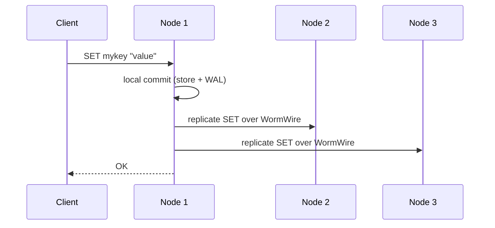

# Clustering

WormDB's cluster mode is optional. When enabled, nodes use embedded meshguard for identity, SWIM gossip over UDP, WireGuard tunnel setup, and WormWire TCP replication. There is no external coordinator — no ZooKeeper, no etcd, no leader election.

## Forming a Cluster

### Step 1: Start the Seed Node

The first node starts without a `--seed` flag. It becomes the seed that other nodes will join:

```bash
./zig-out/bin/wormdb --cluster myapp --port 6389 --data ./data1
```

The `--cluster myapp` flag enables the cluster subsystem and assigns the cluster name `myapp`. Nodes with different cluster names will not join each other.

### Step 2: Join Additional Nodes

Start more nodes with the `--seed` flag pointing to any existing node's gossip endpoint:

```bash
./zig-out/bin/wormdb --cluster myapp --seed 127.0.0.1:51821 --port 6390 --data ./data2
./zig-out/bin/wormdb --cluster myapp --seed 127.0.0.1:51821 --port 6391 --data ./data3
```

::: tip
The `--seed` address is only used during initial discovery. Once a node joins the gossip mesh, it learns about all other nodes automatically. You only need one stable seed per environment.
:::

### Step 3: Verify Membership

```bash
bun run apps/bun/src/bin/client.ts --port 6389 CLUSTER STATUS
```

```
cluster_enabled=1
cluster_nodes=3
cluster_alive=3
cluster_suspected=0
cluster_dead=0
replication_factor=0
proof_checkpoint_records=0
proof_witness_records=0
proof_last_verified_ms=0
anti_entropy_mode=full
```

For detailed per-peer information:

```bash
bun run apps/bun/src/bin/client.ts --port 6389 CLUSTER PEERS
```

```
self_mesh_ip=10.0.0.1
self_port=6389
---
mesh_ip=10.0.0.2
state=alive
gossip_endpoint=10.0.0.2:51821
wormwire=connected
root_sync=healthy
root_sync_last_ms=1780957400000
root_sync_missing_ranges=0
---
mesh_ip=10.0.0.3
state=alive
gossip_endpoint=10.0.0.3:51821
wormwire=connected
root_sync=unknown
root_sync_last_ms=0
root_sync_missing_ranges=0
```

## How Replication Works



Replication happens **after local commit**. The client receives `OK` once the originating node has committed to its own store (and WAL, if persistence is `full`). Replication to peers is then attempted. If replication fails, the response includes an error note, but the local write is not rolled back.

::: warning
This is an **eventually consistent** model. If a node crashes after local commit but before replication completes, other nodes may be missing the latest write. There is no quorum or consensus protocol.
:::

For WORM append logs, the proof layer can store meshguard/WormDB identity-backed checkpoint witnesses as WORM data. `EXEC append_log_witness_request <log_id> <checkpoint_hash_hex>` asks live peers to countersign a local checkpoint over the replication connection; the peer stores the witness through the durable WORM path and it replicates back like any other proof record.

Reconnect anti-entropy now probes a compact deterministic prefix root before sending a full-state scan. If local and peer roots match, the full sync is skipped. If the peer is a verified sorted-prefix subset of local state, WormDB sends only the missing tail entries using the same vector-aware replication frames as full sync. Diverged, ahead, or unverifiable roots fall back to the existing full-state sync path. See [Replication Proofs](/architecture/replication-proofs).

## Cluster Flags

| Flag                 | Description                                 | Default  |
| -------------------- | ------------------------------------------- | -------- |
| `--cluster <name>`   | Enable cluster mode with this cluster name  | Disabled |
| `--seed <host:port>` | Gossip endpoint of an existing node to join | None     |
| `--replicas <n>`     | Replication factor hint (`0` = all peers)   | `0`      |
| `--gossip-port <n>`  | UDP port for SWIM gossip                    | `51821`  |
| `--wg-port <n>`      | WireGuard listen port used by meshguard     | `51830`  |

Org-trust certificate issuance and enforcement is available in meshguard. WormDB currently runs the embedded cluster path in open mode; exposing meshguard org-trust configuration through WormDB CLI/config is tracked as follow-up work.

## Node Identity

Each node generates a unique identity stored in the `--data` directory on first startup. If you move the data directory to a new machine, the node retains its identity. If you delete the data directory, the node gets a new identity and appears as a new member to the cluster.

## Peer States

The SWIM protocol classifies each peer into one of four states visible in `CLUSTER PEERS`:

| State       | Meaning                                                |
| ----------- | ------------------------------------------------------ |
| `alive`     | Responding to health checks                            |
| `suspected` | Missed recent health checks, under probation           |
| `dead`      | Confirmed unreachable, removed from active replication |
| `left`      | Gracefully departed the cluster                        |

## Operational Tips

- **Always check `CLUSTER PEERS` after a node join** — confirm that `wormwire=connected` for all alive peers.
- **Use separate data directories per node** — even on the same machine, each node must have its own `--data` path.
- **Monitor `cluster_suspected`** — a non-zero value means a node might be going down. Investigate promptly.
- **Prefer a dedicated seed host** — while any node can be a seed, having one stable seed simplifies automation and reduces the chance of split-brain during initial formation.
