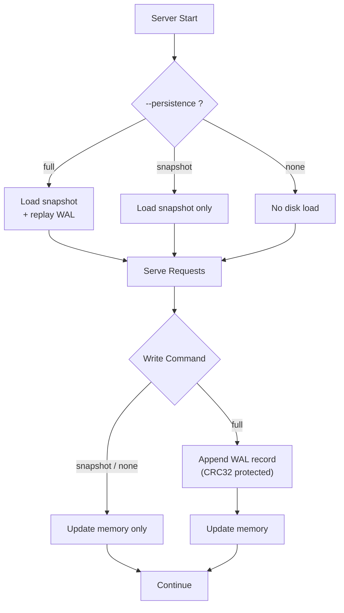

# Persistence Modes

WormDB offers three persistence modes via the `--persistence` flag. The right choice depends on your tolerance for data loss versus your write throughput requirements.

## Overview

| Mode       | What It Does                         | Data Survives Crash?           | Per-Write Disk IO? |
| ---------- | ------------------------------------ | ------------------------------ | ------------------ |
| `full`     | WAL append on every write + snapshot | ✅ Yes (snapshot + WAL replay) | Yes                |
| `snapshot` | Snapshot on shutdown/SAVE only       | ⚠️ Last snapshot only          | No                 |
| `none`     | Pure in-memory                       | ❌ No                          | No                 |



## Full Mode

```bash
./zig-out/bin/wormdb --persistence full --port 6389 --data ./data
```

Every `SET` and `DEL` is appended to the Write-Ahead Log before the response is sent. On startup, the server loads any existing snapshot and then replays the WAL to recover writes made after the last snapshot.

This is the **strongest durability guarantee**. If the process crashes or the machine loses power, you lose at most the writes that were in-flight at the moment of failure. This is the default mode.

::: tip
Use `SAVE` periodically or before maintenance to write a fresh snapshot. This allows WAL truncation and speeds up the next startup — fewer records to replay.
:::

### Sync Behavior

By default, WAL writes are synchronous (`sync_writes=true`), meaning the operating system is instructed to flush to disk. The `--no-sync` flag disables this:

```bash
./zig-out/bin/wormdb --persistence full --no-sync --port 6389 --data ./data
```

This trades a meaningful reduction in write latency for weaker durability — the OS may buffer writes, so a power loss could lose the last few records even though they were "appended" to the WAL.

## Snapshot Mode

```bash
./zig-out/bin/wormdb --persistence snapshot --port 6389 --data ./data
```

No WAL is maintained. Writes go directly to memory. On shutdown (or when you run `SAVE`), the entire key-value state is serialized to a snapshot file.

**When to use this**: workloads with high write throughput where losing data between snapshots is acceptable. For example, a caching layer or an aggregation buffer that can be rebuilt.

::: warning
If the process crashes without a clean shutdown, all writes since the last `SAVE` are lost. Use this mode only when you have a recovery strategy (e.g., the data can be recomputed from an external source).
:::

## Memory Mode

```bash
./zig-out/bin/wormdb --persistence none --port 6389
```

No disk IO at all. No snapshot, no WAL. Data exists only in process memory and is lost completely on exit.

**When to use this**: tests, experiments, ephemeral caches, and development. The `--data` flag is not required in this mode.

## WAL Implementation Details

- Records are protected with CRC32 checksums to detect corruption during replay.
- WAL truncation happens only in `full` mode, after a successful snapshot write.
- The `wal_size` field in `STATUS` output tracks the current WAL file size in bytes — use this for monitoring growth.
- Snapshot v2 persists HNSW graphs, tombstones, timestamps, and RaBitQ parameters in an `WDBHNSW2` trailer after the KV snapshot.
- WAL replay restores durable vector keys after the latest snapshot. Vector namespaces written through `VINSERT`, `VBULKINSERT`, `vinsert`, or `mem_add` persist metric metadata and are automatically rebuilt from recovered `vec:*` keys on startup. Run `EXEC vreindex <namespace>` after raw `SET` ingest, old data without metric metadata, or suspected index corruption.

```bash
bun run apps/bun/src/bin/client.ts STATUS
```

```
keys=1042
wal_size=65536
cluster_enabled=0
```

If `wal_size` grows continuously, consider scheduling periodic `SAVE` commands to trigger snapshot + truncation.

## Procedure Durability

Stored procedures have both unsafe and durable Ctx helpers. `ctx.set()` and `ctx.del()` mutate in-memory state directly and are durable only after the next snapshot. Procedures that must behave like normal client writes should use `ctx.setDurable()`, `ctx.setDurableWorm()`, or `ctx.deleteDurable()`, which go through the WAL and cluster replication path.
