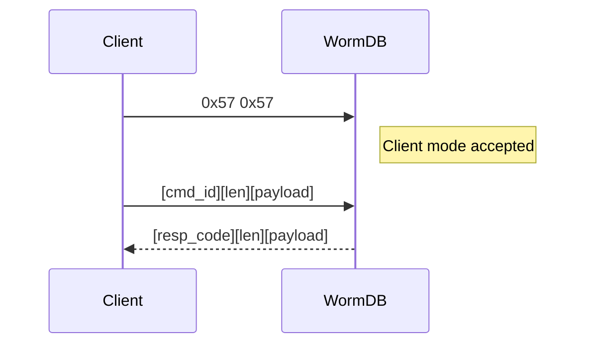

# WormWire Protocol (v1)

WormWire is a purpose-built binary protocol for WormDB. Rather than repurposing an existing text protocol like Redis RESP, WormDB uses a compact binary framing format that eliminates text parsing overhead, removes delimiter ambiguity, and encodes commands as typed IDs rather than string names.

The same command model is used by the TCP server, the browser WebSocket gateway, the QUIC/WebTransport gateway, and peer replication. Raw TCP uses the `WW`/`WR` preface described below; browser gateways carry framed commands inside WebSocket or WebTransport streams. Some command IDs are public client commands; `WR` replication links also use peer-only frames such as `VRABITQ_INSTALL`.

## Connection Handshake

Every TCP connection begins with a 2-byte magic preface that identifies the connection type:

| Magic              | Meaning                               |
| ------------------ | ------------------------------------- |
| `0x57 0x57` (`WW`) | Client connection                     |
| `0x57 0x52` (`WR`) | Replication (peer-to-peer) connection |

Connections without a valid magic preface are rejected immediately. This prevents accidental connections from HTTP clients, text tools, or scanners from being processed.



## Frame Format

Both requests and responses use the same 5-byte header:

```
Request:   [1B command_id]    [4B payload_len BE] [payload bytes]
Response:  [1B response_code] [4B payload_len BE] [payload bytes]
```

- All lengths are **big-endian** unsigned 32-bit integers
- Maximum payload size is **16 MiB** (`16,777,216` bytes)
- Frames with a payload length exceeding the limit are rejected as `request too large`

The fixed-width header means a reader always knows exactly how many bytes to expect after reading the first 5 bytes. No scanning for delimiters, no variable-length header encoding.

## Response Codes

| Code   | Name         | Payload            | When                                                   |
| ------ | ------------ | ------------------ | ------------------------------------------------------ |
| `0x00` | `ok`         | None               | Successful write, delete, subscribe, save              |
| `0x01` | `value`      | Data bytes         | Successful GET, STATUS, or procedure that returns data |
| `0x02` | `null_value` | None               | GET on a nonexistent key                               |
| `0x03` | `err`        | UTF-8 error string | Any error (WORM violation, malformed frame, etc.)      |
| `0x04` | `event`      | Channel + message  | Pub/sub event delivered to a subscriber                |

## Event Payload Format

Event frames (response code `0x04`) carry both the channel name and the message:

```text
[4B channel_len][channel bytes][4B message_len][message bytes]
```

Client libraries should dispatch `0x04` responses separately from command responses — a subscribed client may receive interleaved command responses and event deliveries on the same connection.

## Implementing a Client

If you're writing a WormWire client library, here's the minimal flow:

1. Open a TCP connection and send `0x57 0x57`
2. For each command, encode the frame: `[1B cmd_id][4B payload_len BE][payload]`
3. Read the response: `[1B resp_code][4B payload_len BE][payload]`
4. Handle the response code to determine success, error, or event

See [Command Reference](/protocol/commands) for the exact command IDs and payload layouts for each command.

## Verifiable Proof Bundles

WORM applications can export independently verifiable proof packets containing record hashes, accumulator inclusion material, and signed checkpoints. See [Verifiable Proof Bundles](/protocol/proofs) for the checkpoint signing format and verifier flow.

For engine-level linear provenance chains, see [Verifiable Append Log](/protocol/append-log) for the canonical event envelope and WORM sequence-key format.

## Browser Gateways

Browser clients do not open raw TCP sockets and do not send the TCP `WW` preface. Use the gateway port for WormWire frames over WebSocket or QUIC/WebTransport. The gateway can also enforce SCT auth before forwarding commands to the executor. See [Gateways](/operations/gateways).
